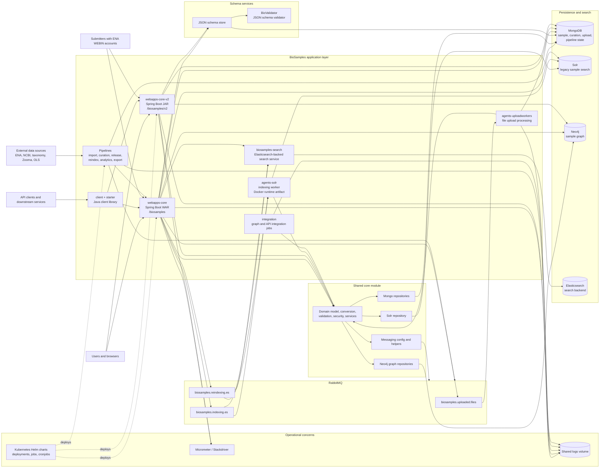
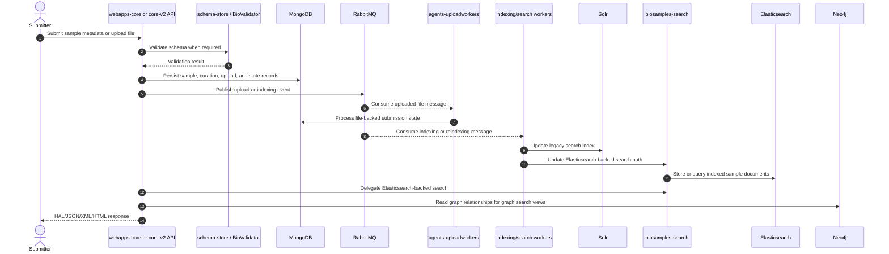
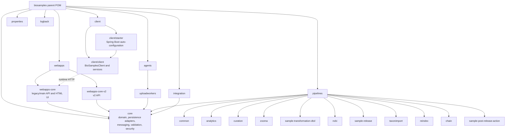

# BioSamples v4 System Design Diagram

This diagram is based on the Maven modules in `pom.xml`, the local deployment topology in
`docker-compose.yml`, and the shared infrastructure wiring in `core`.

## Runtime Architecture

## Primary Write And Index Flow

## Maven Module Map

## Notes

- `core` is the shared application foundation. It contains Mongo, Solr, and Neo4j adapters, validation clients, messaging constants/configuration, security services, and domain conversion logic.
- `webapps-core` is the main deployed API/UI at `/biosamples`; `webapps-core-v2` exposes the newer `/biosamples/v2` API surface.
- Pipelines are batch/import/transformation jobs. In local Docker they call the main API through `BIOSAMPLES_CLIENT_URI`, while some pipeline modules also use shared persistence helpers.
- RabbitMQ is used for uploaded-file processing and indexing/reindexing queues:
  `biosamples.uploaded.files`, `biosamples.indexing.es`, and `biosamples.reindexing.es`.
- `docker-compose.yml` includes `biosamples-agents-solr`, but the current Maven `agents` aggregate only lists `uploadworkers`. Treat `agents-solr` as a runtime artifact or legacy/external module unless the build configuration is restored.
- Kubernetes assets under `k8s/` describe deployment, job, and cronjob packaging for non-local environments.
